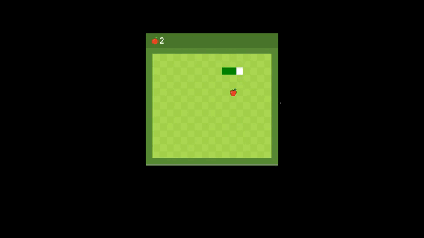

# Snake 
The snake game is written in pure js for a better understanding of the language structure, as this is my first  `JavaScript` project.
The most suitable picture from the Internet is used as a playing space, and an icon is used as an apple.

## Function
to move the snake around the map, the dimensions of each square in
pixels were calculated and used to dynamically move the snake along
each calculated square, depending on the button pressed, the keys
were bound to the  `WASD`

## GUI 
a suitable picture in PNG format was selected as a `field` for a snake, and an icon in the corresponding form as an `apple`
a `snake` is just an array consisting of a snake's head of a separate `color` and the rest of the body (array)
